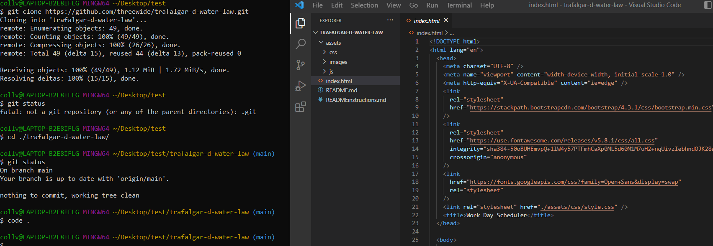

# 05-Module

## Description

For the 05-Module project we were to create a work day scheduler that allows users to save events. Bootstrap was used to make a grid that held the time, event and save button in a row. In the javascript a setCurrentDate and setTextAreasFromLocal were implemented to propagate the current date and event fields. I was running out of time so was unable to fully implement the dynamic html and css. There is much room for improvemt in the functionality and style. 

## Table of Contents

- [Installation](#installation)
- [Credits](#credits)
- [License](#license)

## Installation

To setup the project on your computer follow these steps:

1. open terminal command and navigate to the desired directory for the repository with the command cd
2. use the command "git clone https://github.com/threewide/trafalgar-d-water-law.git" to create a clone of the respository on your local machine
2. use the command "code ." to open in VS Code

## Credits

Rich Widtmann [Professional README Guide](https://coding-boot-camp.github.io/full-stack/github/professional-readme-guide)
Course Gitlab [Instructor Demo: Git](https://utoronto.bootcampcontent.com/utoronto-bootcamp/UTOR-VIRT-FSF-FT-05-2022-U-LOLC/-/tree/main/01-HTML-Git-CSS/01-Activities/03-Ins_Git)
Choose a License [MIT License Template](https://choosealicense.com/licenses/mit/)

## License

Copyright (c) [2022] [Justin Collver]

Permission is hereby granted, free of charge, to any person obtaining a copy
of this software and associated documentation files (the "Software"), to deal
in the Software without restriction, including without limitation the rights
to use, copy, modify, merge, publish, distribute, sublicense, and/or sell
copies of the Software, and to permit persons to whom the Software is
furnished to do so, subject to the following conditions:

The above copyright notice and this permission notice shall be included in all
copies or substantial portions of the Software.

THE SOFTWARE IS PROVIDED "AS IS", WITHOUT WARRANTY OF ANY KIND, EXPRESS OR
IMPLIED, INCLUDING BUT NOT LIMITED TO THE WARRANTIES OF MERCHANTABILITY,
FITNESS FOR A PARTICULAR PURPOSE AND NONINFRINGEMENT. IN NO EVENT SHALL THE
AUTHORS OR COPYRIGHT HOLDERS BE LIABLE FOR ANY CLAIM, DAMAGES OR OTHER
LIABILITY, WHETHER IN AN ACTION OF CONTRACT, TORT OR OTHERWISE, ARISING FROM,
OUT OF OR IN CONNECTION WITH THE SOFTWARE OR THE USE OR OTHER DEALINGS IN THE
SOFTWARE.